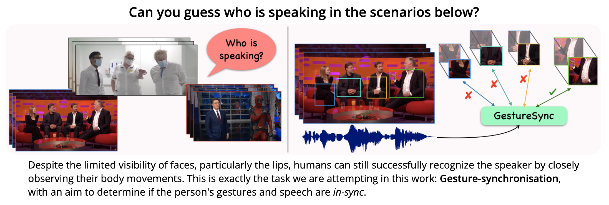
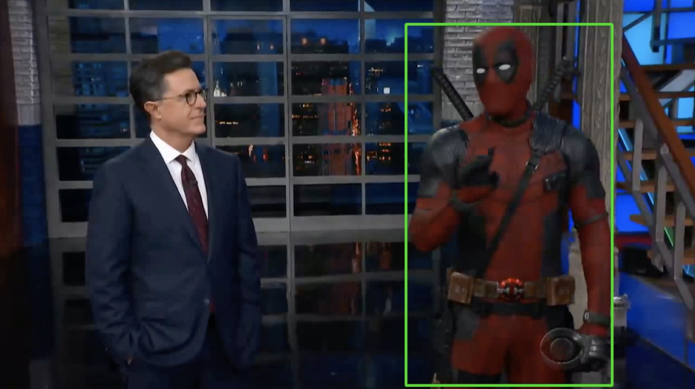
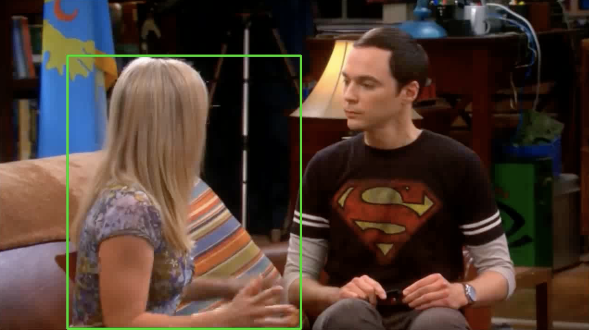

# Gesture Synchronisation 

This code is for our paper titled: **GestSync: Determining who is speaking without a talking head** published at BMVC 2023 (oral).<br />
**Authors**: [Sindhu Hegde](https://sindhu-hegde.github.io), [Andrew Zisserman](https://scholar.google.com/citations?hl=en&user=UZ5wscMAAAAJ) 

|   📝 Paper   |   📑 Project Page    |  🛠 Demo Video  |
|:-----------:|:-------------------:|:------------------:|
| [Paper](https://arxiv.org/pdf/2310.05304) | [Website](https://www.robots.ox.ac.uk/~vgg/research/gestsync/) | [Video](https://youtu.be/AAdicSpgcAg) | 
<br />


<p align="center">
    
</p>

------
Highlights
-----
- The trained network can be used for 2 tasks:
  - **Synchronisation:** Predicting the temporal lags between the audio and visual streams in a video solely based on gestures.
  - **Active Speaker Detection:** Determining "who is speaking" in a multi-speaker scenario without looking at their faces.
- Works in unconstrained settings for any speaker in any language.
- Wider applications: Since the model does not require face input, it eliminates the problem of corrupted, occluded or invisible face or lip regions. 
- Complete training and inference pipelines, along with pre-trained models will be released soon. 

------
Installation
-----
Clone the repository

    git clone https://github.com/Sindhu-Hegde/gestsync.git

Install the required packages (it is recommended to create a new environment)

    python -m venv env_gestsync
    source env_gestsync/bin/activate
    pip install -r requirements.txt

Activate the environment

    source env_gestsync/bin/activate

------
Pretrained models
-----
Download the trained models and save in `checkpoints` folder

| Model  | Description |  Link to the model | 
| :-------------: | :---------------: | :---------------: |
| RGB model  | Weights of the RGB-based GestSync model | [Link](https://drive.google.com/drive/folders/1F35PfHGJ_guanl_tCV0CX9jNr9kY6359?usp=sharing) |---
| Keypoint model  | Weights of the keypoint-based GestSync model | TBD |
---
Inference
-----

### Predicting the audio-visual synchrnoisation offset

It is now possible to sync-correct any video solely based on Gestures (no face needed)! 
Give any video where the speaker's gestures are visible and use our network to predict the synchronisation offset and obtain the sync-corrected video as output.  

    python inference_syncoffset.py --checkpoint_path=<path_to_model> --video_path=<path_to_video>

Following demo videos are available for a quick test: 


| Video path | Actual offset  |
|:--:|:--:|
| samples/sync_sample_1.mp4 | 0 |
| samples/sync_sample_2.mp4 | 25 |
| samples/sync_sample_3.mp4 | -15 |


Example run:

    python inference_syncoffset.py --checkpoint_path=checkpoints/model_rgb.pth --video_path=samples/sync_sample_1.mp4
    
All the input and output files are saved (by default) in `results` folder. The result directory can be specified in arguments, similar to several other available options. The input file can be any video file with a single speaker and visible gestures. The code will pre-process the video (pre-processed files will be saved in  `results/input` folder) and  generate the sync-corrected video (result files will be saved in `results/output` folder).

The optional parameter `num_avg_frames` specifies the number of video frames used to average the scores. Higher the number of average frames, better the results. To obtain a more accurate offset prediction, give a longer video as input and set the `num_avg_frames` to be higher (example 100).  

Example run:

    python inference_syncoffset.py --checkpoint_path=checkpoints/model_rgb.pth --video_path=samples/sync_sample_2.mp4 --num_avg_frames=75

### Predicting "who is speaking" in a multi-speaker scene

Our model can be used to predict "who is speaking" based on gestures in a multi-speaker video (no face needed). Give any video with two or more speakers with visible gestures in the scene and use our network to predict the active speaker and obtain the video output with the bounding box as shown below.


    python inference_activespeaker.py --checkpoint_path=<path_to_model> --video_path=<path_to_video>


<p align="center">
  
  
</p>   

Following demo videos are available for a quick test: `samples/asd_sample_1.mp4`, `samples/asd_sample_1.mp4`


Example run:

    python inference_activespeaker.py --checkpoint_path=checkpoints/model_rgb.pth --video_path=samples/asd_sample_1.mp4 --global_speaker=True

All the input and output files are saved (by default) in  `results`  folder. The result directory can be specified in arguments, similar to several other available options. The input file can be any video file with atleast two speakers with visible gestures. The code will pre-process the video (pre-processed files will be saved in  `results/input`  folder) and generate the video with the bounding-box ob the active speaker (result files will be saved in  `results/output`  folder). The above code predicts a single active speaker for the entire input video.

To obtain more fine-grained per-frame results, set the parameter `global_speaker=False` and specify the `num_avg_frames` to indicate number of video frames used to average the scores. Higher the number of average frames, better the results. To obtain a more accurate offset prediction, give a longer video as input and set the `num_avg_frames` to be higher (example 100).  

Example run:

    python inference_activespeaker.py --checkpoint_path=checkpoints/model_rgb.pth --video_path=samples/asd_sample_2.mp4 --global_speaker=False --num_avg_frames=50


---
Training
-----

Coming soon!

---
Licence and Citation
---
The software is licensed under the MIT License. Please cite the following paper if you have used this code:

```
@InProceedings{Hegde_BMVC_2023,
  author       = "Hegde, Sindhu and Zisserman, Andrew",
  title        = "GestSync: Determining who is speaking without a talking head",
  booktitle    = "BMVC",
  year         = "2023",
}
```

